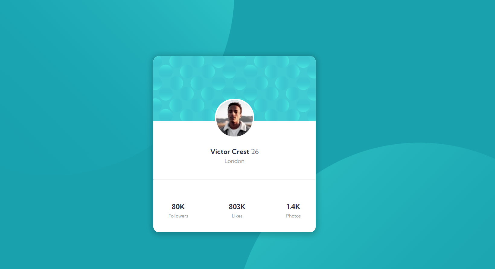

# Frontend Mentor - Profile card component solution

This is a solution to the [Profile card component challenge on Frontend Mentor](https://www.frontendmentor.io/challenges/profile-card-component-cfArpWshJ). Frontend Mentor challenges help you improve your coding skills by building realistic projects. 

## Table of contents

- [Frontend Mentor - Profile card component solution](#frontend-mentor---profile-card-component-solution)
  - [Table of contents](#table-of-contents)
  - [Overview](#overview)
    - [The challenge](#the-challenge)
    - [Screenshot](#screenshot)
    - [Links](#links)
  - [My process](#my-process)
    - [Built with](#built-with)
    - [What I learned](#what-i-learned)
    - [Continued development](#continued-development)
    - [Useful resources](#useful-resources)
  - [Author](#author)
  - [Acknowledgments](#acknowledgments)

## Overview

This is **Profile Card Componenet Challenge On Frontend Mentor** made by me.

### The challenge

- Build out the project to the designs provided

### Screenshot




### Links

- Solution URL: [Click for solution URL here](https://github.com/codekesh/Profile-card-component.git)
- Live Site URL: [Click for live site URL here](https://codekesh.github.io/Profile-card-component/)

## My process

### Built with

- Semantic HTML5 markup
- CSS custom properties
- Mobile-first workflow

### What I learned
I learnt how to adjust background in CSS.

```css
.proud-of-this-css {
background: url('../images/bg-pattern-top.svg') right 50vw bottom no-repeat, url('../images/bg-pattern-bottom.svg') 50vw 50vh no-repeat;
}
```

### Continued development
I will continue this journey.

### Useful resources

- [Kumbh Sans](https://fonts.google.com/specimen/Kumbh+Sans) - This helped me for font-style. I really liked this font and will use it going forward.

## Author

- Frontend Mentor - [@@codekesh](https://www.frontendmentor.io/profile/codekesh)
- Twitter - [@tulsyan_keshav](https://twitter.com/tulsyan_keshav)
- Github - [@codekesh](https://github.com/codekesh)

## Acknowledgments
I am solo player for this project. I am beginner so for learning purpose, I tried my own and I think I give my best for making this website.
